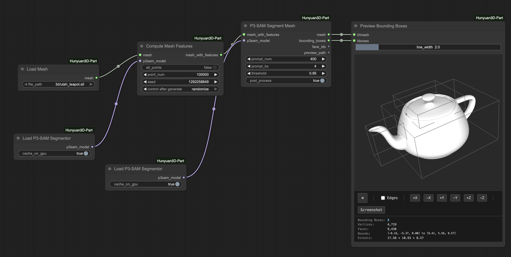
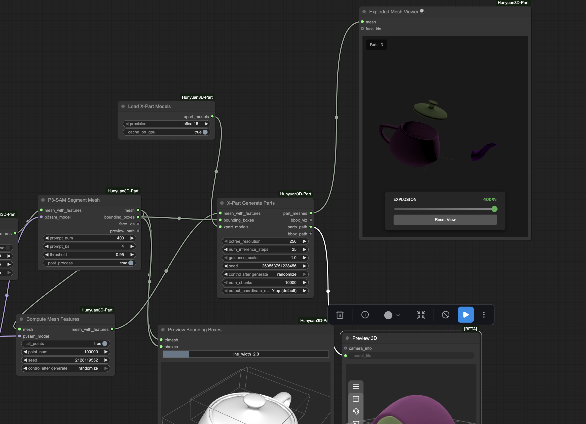

# ComfyUI-Hunyuan3D-Part

## Installation

Three options, in order of speed → reliability:

1. **ComfyUI Manager (nightly)** — search for `ComfyUI-Hunyuan3D-Part` in the Manager and click Install. Fastest, but the Manager's nightly index can lag.
2. **Manager via Git URL** — in ComfyUI Manager: "Install via Git URL" with `https://github.com/PozzettiAndrea/ComfyUI-Hunyuan3D-Part.git`.
3. **Manual (most reliable)**:
   ```bash
   cd ComfyUI/custom_nodes
   git clone https://github.com/PozzettiAndrea/ComfyUI-Hunyuan3D-Part.git
   cd ComfyUI-Hunyuan3D-Part
   pip install -r requirements.txt --upgrade
   python install.py
   ```


<div align="center">
<a href="https://pozzettiandrea.github.io/ComfyUI-Hunyuan3D-Part/">

</a>
<br>
<b><a href="https://pozzettiandrea.github.io/ComfyUI-Hunyuan3D-Part/">View Live Test Gallery →</a></b>
</div>

ComfyUI custom nodes for Hunyuan3D-Part: 3D part segmentation and generation.

## Features

**P3-SAM Segmentation**: Segment 3D meshes into parts


**X-Part Generation**: Generate high-quality part meshes using diffusion



## Community

Questions or feature requests? Open a [Discussion](https://github.com/PozzettiAndrea/ComfyUI-Hunyuan3D-Part/discussions) on GitHub.

Join the [Comfy3D Discord](https://discord.gg/bcdQCUjnHE) for help, updates, and chat about 3D workflows in ComfyUI.

## Credits

Based on [Hunyuan3D-Part](https://github.com/tencent/Hunyuan3D-Part) by Tencent.